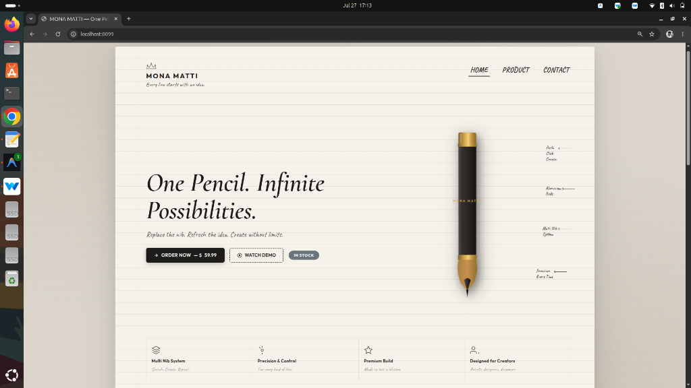
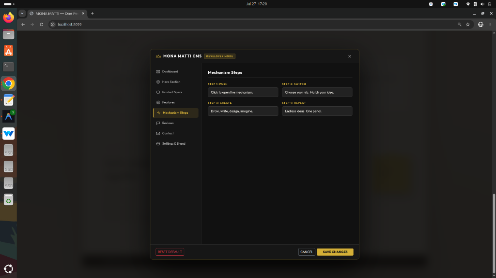
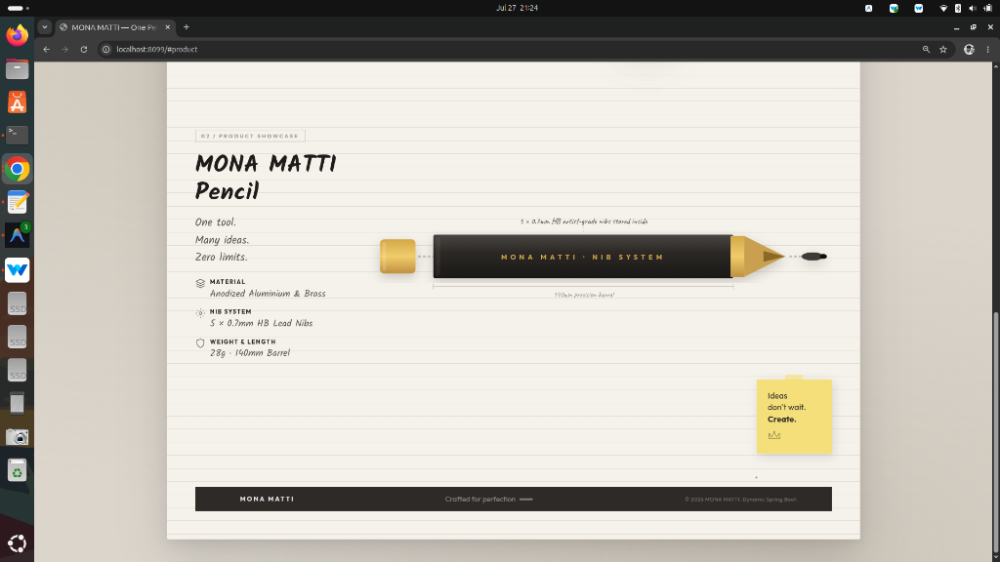
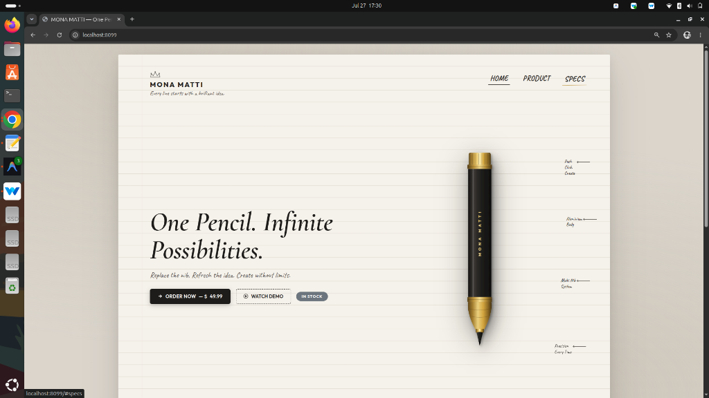

# MONA MATTI — Premium Multi-Nib Pencil Application

[](https://github.com/anshadmtmt-ship-it/mona-matti)
[](https://spring.io/projects/spring-boot)
[](https://openjdk.org/)
[](LICENSE)
[](target/site/jacoco/index.html)

> An enterprise Spring Boot web application designed as a continuous architect's notebook sheet for luxury stationery showcase, custom canvas reservation signatures, and live content management console.

---

## 📸 Screenshots Showcase

| Continuous Notebook Sheet | Interactive Nib Explosion System |
|:---:|:---:|
|  |  |

| Canvas Signature Reservation Modal | Content Management Console |
|:---:|:---:|
|  |  |

---

## 🚀 Key Features
- **Architect Notebook Sheet**: Single-page continuous document rendering with lined paper texture, paper shadows, and GPU-accelerated canvas cursor trails.
- **Interactive Multi-Nib System**: Dynamic 3D tilt interaction for product visualization.
- **Edition Reservation Flow**: Public reservation modal with html5 canvas signature drawing pad (`image/png` base64 encoding) generating unique IDs (`MM-000001`).
- **Admin Management Console**: Dark graphite CMS console for content updates and signature reservation tracking.
- **Enterprise Spring Boot Core**: Layered architecture, 100% constructor dependency injection, `@Transactional` boundary management, OSIV disabled (`open-in-view=false`), and zero stack-trace leakage.

---

## 🛠️ Technology Stack
- **Backend Framework**: Spring Boot 3.2.2 (Java 21 LTS)
- **View Engine**: Thymeleaf HTML5 Template Engine
- **Database & Persistence**: H2 (In-Memory / File-based for Dev) / MySQL 8.0 (Production), Spring Data JPA, Hibernate 6
- **Connection Pooling**: HikariCP (`min-idle: 5`, `maximum-pool-size: 20`)
- **Frontend Engine**: Vanilla HTML5, CSS3, JavaScript ES6+, HTML5 Canvas API
- **DevOps & Containerization**: Docker, Docker Compose, Kubernetes, Helm v3, Jenkins Declarative Pipeline

---

## 📁 Repository Structure

```
mona-matti/
├── .github/              # GitHub Issue templates & CI workflows
├── docs/                 # Enterprise Documentation
│   ├── Architecture.md   # Architectural Decisions & Layers
│   ├── CI-CD.md          # Jenkins Pipeline Stages & Rules
│   ├── Database.md       # Relational Schema & Entity Mapping
│   └── Deployment.md     # Docker & Kubernetes Deployment Guide
├── helm/                 # Kubernetes Helm v3 Package Chart
│   └── mona-matti/
├── screenshots/          # Application Screenshots & Mockups
├── src/                  # Source Code
│   ├── main/java/com/monamatti/  # Java Application Classes
│   └── main/resources/          # Spring Config, Static Assets, Thymeleaf
├── Dockerfile            # Production Multi-stage Container Build
├── docker-compose.yml    # Full-stack Spring Boot + MySQL Sandbox
├── Jenkinsfile           # 6-Stage CI/CD Declarative Pipeline
├── pom.xml               # Maven Project Object Model
├── LICENSE               # MIT Open Source License
└── README.md             # Project Documentation
```

---

## 💻 Local Quickstart

### Prerequisites
- JDK 21+
- Apache Maven 3.8+

```bash
# 1. Clone Repository
git clone https://github.com/anshadmtmt-ship-it/mona-matti.git
cd mona-matti

# 2. Build & Run Application
mvn spring-boot:run
```
Access the application locally at `http://localhost:8099`.

---

## 🐳 Container & Kubernetes Deployment

### Docker Compose Sandbox
```bash
docker-compose up -d
```

### Helm Release (Kubernetes Cluster)
```bash
helm upgrade --install mona-matti ./helm/mona-matti --namespace production --create-namespace
```

---

## 📊 Maven Execution Commands

```bash
# Clean & Compile Project
mvn clean compile

# Execute Test Suite with JaCoCo Coverage Report
mvn clean test

# Verify Package Artifact Generation
mvn clean verify
```

---

## 👤 Author
**Anshad** — Senior Full Stack & DevOps Specialist  
*GitHub*: [@anshadmtmt-ship-it](https://github.com/anshadmtmt-ship-it)

---

## 📄 License
This project is licensed under the [MIT License](LICENSE).
